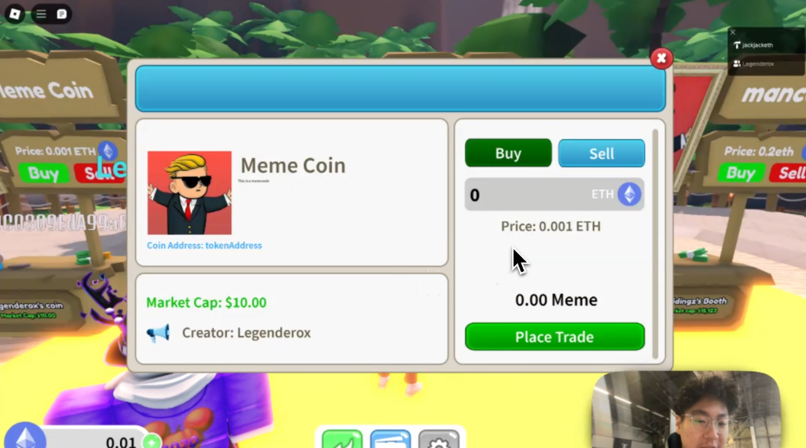
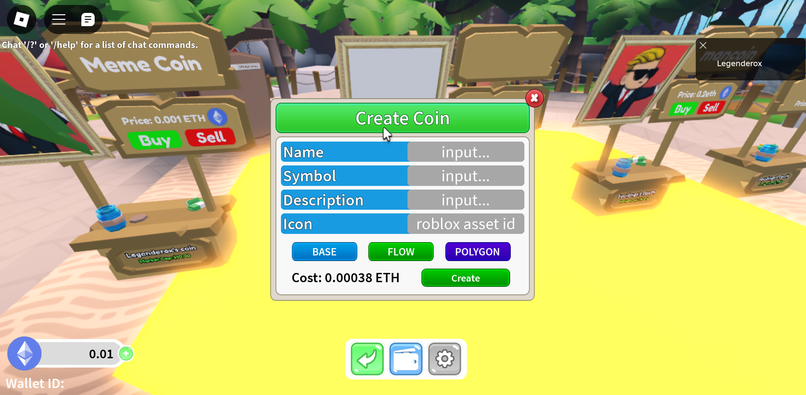
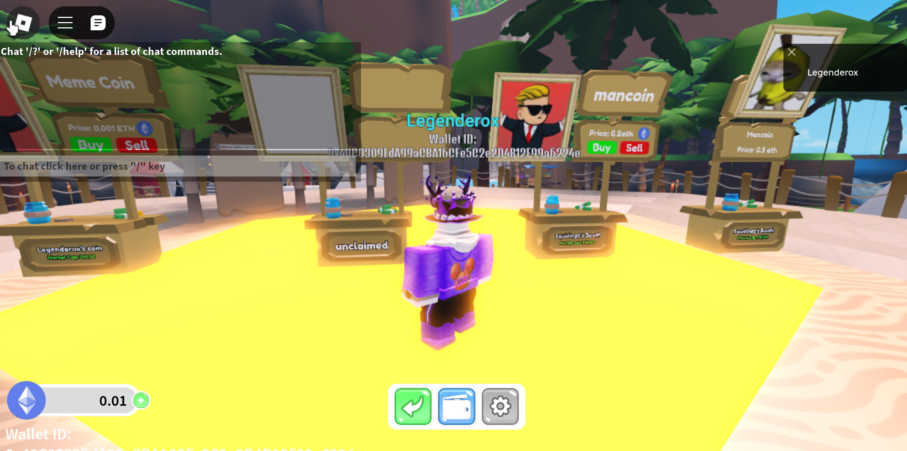
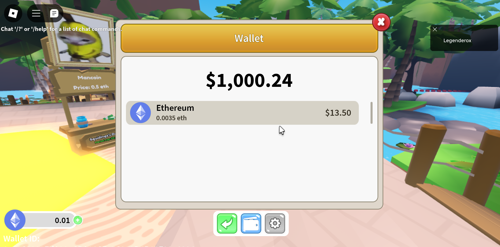

# Roblox Memecoin Exchange

This is the backend and smart contract side of the submission for the EthGlobal 2024 SF 36 hour Hackathon. Winner of $5,000 for the Best Consumer Crypto App @CoinbaseDev and 2nd place Most Killer App @flow_blockchain.

<table>
  <tr>
    <td></td>
    <td></td>
  </tr>
  <tr>
    <td></td>
    <td></td>
  </tr>
</table>

**Repositories**
* Roblox gamplay / frontend: https://github.com/brain-xiang/memecoins-on-roblox
* Server backend and smart contracts: https://github.com/iganbold/roblox-memecoin

### Project Description
We built the first-ever blockchain integration on @Roblox: a memecoin exchange allowing users to create, buy, and sell real coins across multiple blockchains—right from inside the game. No external software required, and we even create a wallet for you! This project is designed to unlock an incredible new frontier for Roblox's 300 million monthly active users (MAU). Through our system, users can create, buy, and sell meme coins, with prices determined by bonding curves that reflect supply and demand. Additionally, we integrated a Multi-Party Computation (MPC) wallet for each user, ensuring secure management of cryptocurrency transactions and seamless interaction with the coins they create.

### How it's Made
We used the Coinbase Developer Platform and Coinbase SDK to manage wallets and facilitate meme coin transactions across Base, Polygon, and Flow blockchains. We built a custom ERC20-based bonding curve smart contract to control token prices based on supply and demand.

For the game, we used Roblox Studio to create the user interface and integrate meme coins into the Roblox ecosystem. The backend was developed with NestJS for server logic and MongoDB for handling user data and transaction history.

One hacky aspect was integrating real crypto transactions with Roblox gameplay, syncing blockchain and in-game interactions smoothly using Coinbase’s SDK and bonding curve contracts.

More here: https://ethglobal.com/showcase/roblox-coin-exchange-833sq